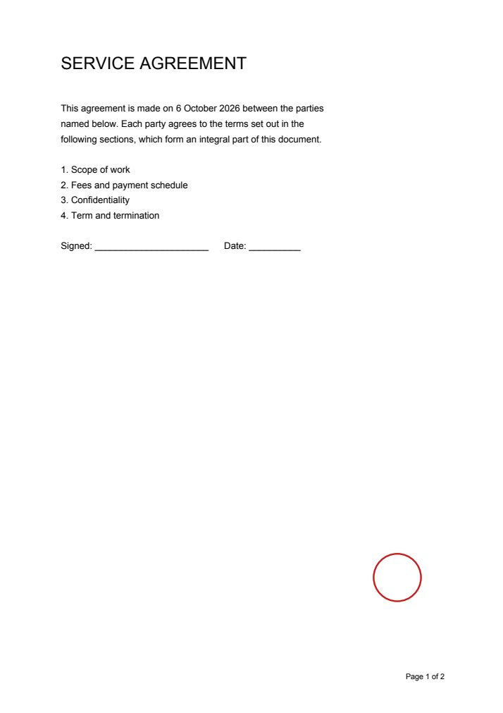
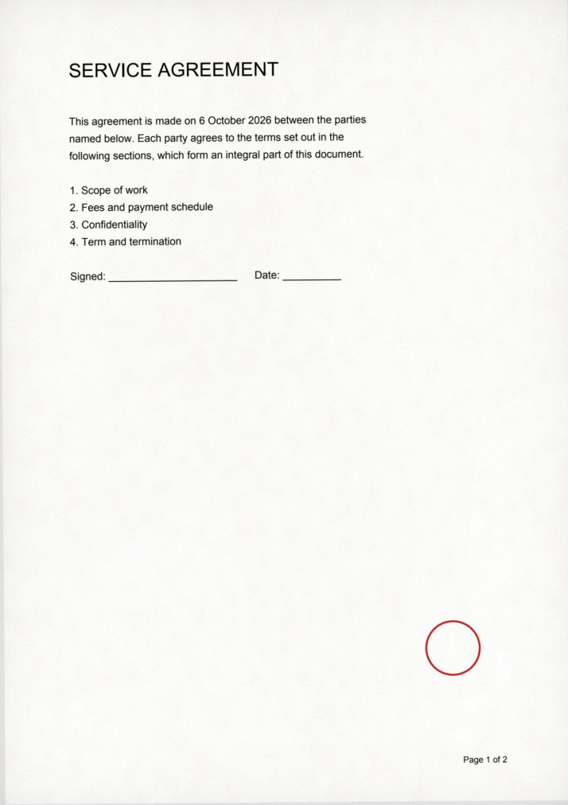

# scannizer

**출력해서 스캔할 필요 없습니다.** 깨끗한 PDF를 실제 스캐너를 거친 것처럼 바꿔 주는 Python 라이브러리 + CLI.
**Don't print it just to scan it.** A Python library + CLI that makes a clean PDF look like it went through a real scanner.

🔗 **데모 / Demo:** https://chizi-develop.github.io/scannizer/

<p align="center">
  
  
</p>

---

## 한국어

### 왜 만들었나

제출용 서류에 "스캔본"을 요구받지만 정작 종이 원본은 아무도 필요로 하지 않는 경우가 많습니다. 그런데도 PDF를 출력하고, 다시 스캐너에 올리고, 파일을 옮기는 일을 반복하게 되죠. scannizer는 그 과정을 명령 한 줄로 대신합니다. 종이 질감, 미세한 기울기, 접힌 자국, 스캐너 가장자리 그림자, 센서 노이즈, JPEG 압축까지 — 결과물은 실제 스캐너가 만드는 것과 같은 텍스트 레이어 없는 이미지 전용 PDF입니다.

### 설치

```
pip install scannizer
```

Python 3.10 이상. 의존성은 pypdfium2, numpy, opencv-python-headless 세 개뿐입니다.

### 사용법

```
scannizer 계약서.pdf                          # → 계약서_scanned.pdf
scannizer 계약서.pdf -o out.pdf --preset heavy --seed 42
scannizer 계약서.pdf --fold trifold --color gray --dpi 150
```

프리셋: `light`(좋은 스캐너, 새 종이) · `normal`(사무실 복합기, 기본값) · `heavy`(오래된 문서, 낡은 스캐너). 어떤 옵션이든 프리셋 값 위에 덮어쓸 수 있습니다.

| 옵션 | 의미 | 범위 |
|---|---|---|
| `--dpi` | 렌더 해상도 | 72–600 |
| `--color` | `color`, `gray`, `bw` | |
| `--jpeg-quality` | JPEG 품질 | 1–95 |
| `--skew` | 최대 기울기(도), 페이지마다 랜덤 | 0–5 |
| `--fold` | 접힘 패턴: `none`, `half`, `trifold` | |
| `--fold-strength`, `--noise`, `--paper`, `--edge-shadow`, `--unevenness` | 효과 강도 | 0–1 |
| `--blur` | 블러 시그마(px, 200 DPI 기준) | 0–3 |

`--seed N`을 주면 항상 같은 결과가 나오고, 생략하면 실행할 때마다 달라집니다. 기본 색상 모드가 `color`인 이유는 붉은 도장·직인을 살리기 위해서입니다.

### Python에서

```python
from scannizer import scan

scan("in.pdf", "out.pdf")
scan("in.pdf", "out.pdf", preset="heavy", seed=42)
scan("in.pdf", "out.pdf", fold="trifold", color="gray")
```

읽을 수 없거나 암호화된 입력, 빈 PDF, 쓸 수 없는 출력 경로는 `scannizer.ScannizerError`, 범위를 벗어난 옵션은 `ValueError`를 냅니다.

---

## English

### Why

Plenty of forms ask for a "scanned copy" when nobody actually needs the paper. You still end up printing the PDF, feeding it back into a scanner and moving the file around. scannizer replaces that round trip with one command: paper texture, a slight tilt, fold creases, scanner edge shadow, sensor noise and JPEG compression. The output is an image-only PDF with no text layer — exactly what a real scanner produces.

### Install

```
pip install scannizer
```

Python 3.10+. Depends on pypdfium2, numpy and opencv-python-headless only.

### Usage

```
scannizer input.pdf                       # → input_scanned.pdf
scannizer input.pdf -o out.pdf --preset heavy --seed 42
scannizer input.pdf --fold trifold --color gray --dpi 150
```

Presets: `light` (good scanner, fresh paper), `normal` (office copier, default), `heavy` (old document, tired scanner). Any option overrides the preset:

| Option | Meaning | Range |
|---|---|---|
| `--dpi` | render resolution | 72–600 |
| `--color` | `color`, `gray`, `bw` | |
| `--jpeg-quality` | JPEG quality | 1–95 |
| `--skew` | max tilt in degrees (random per page) | 0–5 |
| `--fold` | crease pattern: `none`, `half`, `trifold` | |
| `--fold-strength`, `--noise`, `--paper`, `--edge-shadow`, `--unevenness` | effect strength | 0–1 |
| `--blur` | blur sigma in px (at 200 DPI) | 0–3 |

`--seed N` makes the output reproducible; without it every run differs. Colour mode defaults to `color` so red stamps and seals survive.

### Python

```python
from scannizer import scan

scan("in.pdf", "out.pdf")
scan("in.pdf", "out.pdf", preset="heavy", seed=42)
scan("in.pdf", "out.pdf", fold="trifold", color="gray")
```

`scan()` raises `scannizer.ScannizerError` for unreadable, encrypted or empty input and unwritable output paths, and `ValueError` for out-of-range options.

---

## Development

```
uv venv && uv pip install -e . --group dev
python -m pytest
python examples/make_samples.py   # visual check → examples/output/
```

The demo site lives in `site/` and is deployed to GitHub Pages by `.github/workflows/pages.yml` on every push to `main`.

## License

MIT
